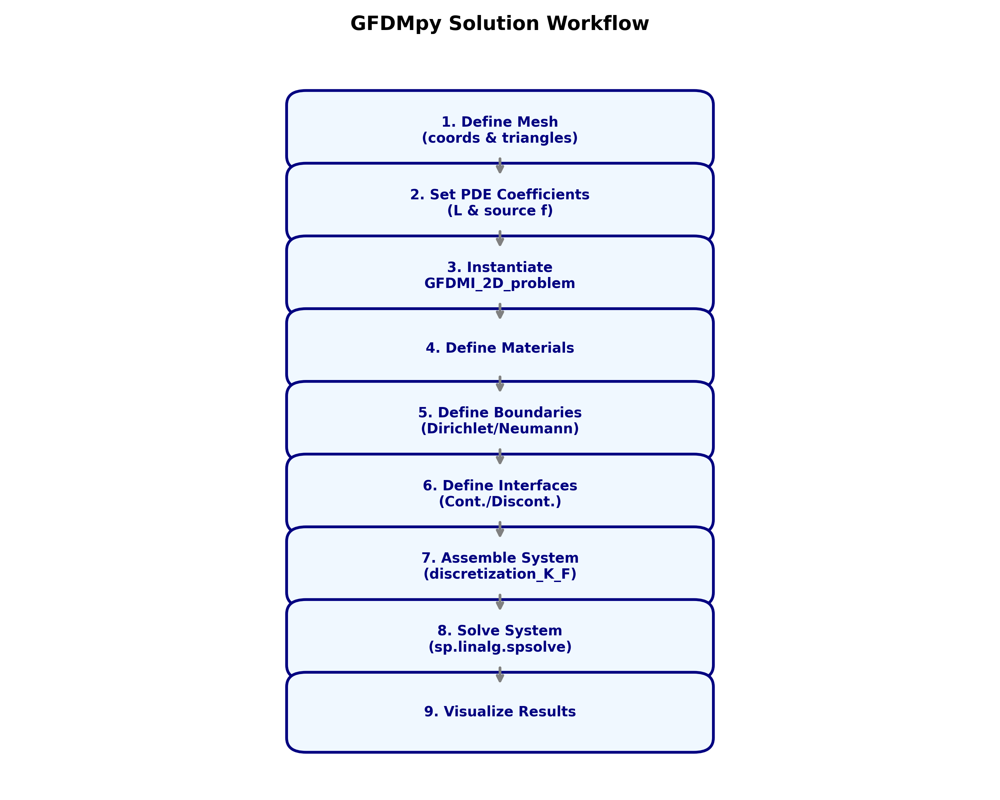

# User Manual - GFDFlow

Welcome to the GFDFlow user manual! This guide will help you understand how to use the Generalized Finite Difference Method (GFDM) for solving 2D interface problems.

## 1. Introduction

The Generalized Finite Difference Method (GFDM) is a meshless method that provides a flexible way to solve partial differential equations (PDEs) on arbitrary point distributions. This library specifically handles 2D problems with:
- Arbitrary geometries.
- Material interfaces with jump conditions.
- Dirichlet and Neumann boundary conditions.

## 2. Installation

You can install the library in editable mode from the project root:

```bash
pip install -e .
```

Ensure you have the following dependencies installed:
- `numpy`
- `scipy`
- `matplotlib`
- `calfem-python`

## 3. Workflow Overview

The following diagram illustrates the typical process for solving a problem with GFDFlow:



> [!TIP]
> This diagram is generated using the `examples/workflow_diagram.py` script.

## 4. Project Structure

Understanding the project layout helps in navigating the source code and examples.

```text
GFDFlow/
├── docs/                # Documentation and Manuals
│   ├── API_REFERENCE.md # Technical API documentation
│   └── USER_MANUAL.md   # This manual
├── examples/
│   ├── basic_example.py
│   └── legacy/
│       ├── Meshes/          # JSON geometry files
│       ├── figures/         # Generated results
│       ├── ex0.py           # Legacy examples...
│       └── ex8.py
├── src/
│   └── GFDFlow/             # Core package
│       ├── GFDM.py          # Main class implementation
│       ├── utils.py         # Utility functions
│       └── __init__.py
├── tests/
│   └── test_gfdmi.py        # Unit tests
├── pyproject.toml           # Build system configuration
├── README.md                # Main project overview
├── requirements.txt         # Dependencies
└── verify_refactor.py       # Verification script
```

## 5. Basic Example: 2D Laplacian

To solve a simple 2D Laplacian problem ($\nabla^2 u = 0$), follow these steps:

### Define the Mesh and Coefficients

```python
import numpy as np
from GFDFlow.GFDM import GFDMI_2D_problem

# Create a simple 2D grid
x = np.linspace(0, 1, 20)
y = np.linspace(0, 1, 20)
X, Y = np.meshgrid(x, y)
coords = np.vstack([X.ravel(), Y.ravel()]).T

# Define triangles for support node selection
from scipy.spatial import Delaunay
tri = Delaunay(coords)
triangles = tri.simplices

# L = [A, B, C, D, E, F] for Au + Bu_x + Cu_y + Du_xx + Eu_xy + Fu_yy = f
L = np.array([0.0, 0.0, 0.0, 1.0, 0.0, 1.0])
source = lambda p: 0.0  # Zero source term

problem = GFDMI_2D_problem(coords, triangles, L, source)
```

### Set Materials and Boundaries

```python
# Material and interior nodes
problem.material("main", lambda p: 1.0, np.arange(len(coords)))

# Boundary conditions
left_nodes = np.where(coords[:, 0] == 0)[0]
right_nodes = np.where(coords[:, 0] == 1)[0]

problem.dirichlet_boundary("left", left_nodes, lambda p: 0.0)
problem.dirichlet_boundary("right", right_nodes, lambda p: 100.0)
```

### Assemble and Solve

```python
import scipy.sparse as sp

K, F = problem.discretization_K_F(continuous=True)
U = sp.linalg.spsolve(K, F)
```

## 6. Advanced: Handling Interfaces

GFDFlow allows for both continuous and discontinuous interface handling. Use the `problem.interface()` method to define the jump conditions ($\beta$ for flux jump and $\alpha$ for potential jump).

### Example Interface Setup

```python
problem.interface(
    "interface_label",
    k_left=lambda p: 1.0, k_right=lambda p: 10.0,
    nodes_left=interface_nodes_side1, 
    nodes_right=interface_nodes_side2,
    beta=lambda p: 0.0,  # Flux jump
    alpha=lambda p: 0.0, # Potential jump
    interior_left=material1_nodes,
    interior_right=material2_nodes
)
```

For more detailed information, consult the [API Reference](API_REFERENCE.md).
